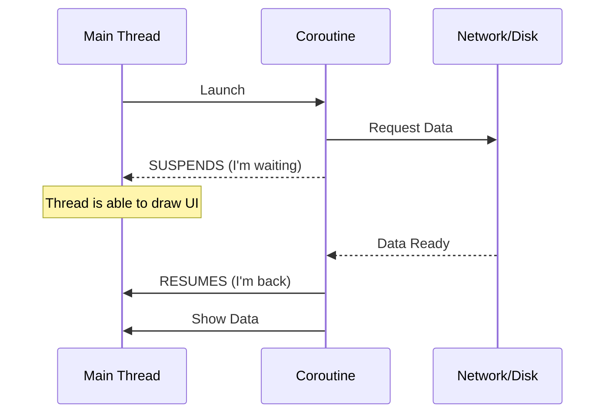
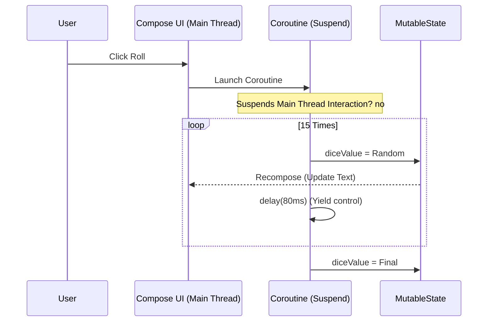

```mermaid
sequenceDiagram
    participant T as Main Thread
    participant C as Coroutine
    participant N as Network/Disk
    
    T->>C: Launch
    C->>N: Request Data
    C-->>T: SUSPENDS (I'm waiting)
    
    note over T: Thread is able to draw UI
    
    N-->>C: Data Ready
    C->>T: RESUMES (I'm back)
    C->>T: Show Data
```

---

```mermaid
sequenceDiagram
    participant User
    participant UI as Compose UI (Main Thread)
    participant Logic as Coroutine (Suspend)
    participant State as MutableState
    
    User->>UI: Click Roll
    UI->>Logic: Launch Coroutine
    
    note over Logic: Suspends Main Thread Interaction? no
    
    loop 15 Times
        Logic->>State: diceValue = Random
        State-->>UI: Recompose (Update Text)
        Logic->>Logic: delay(80ms) (Yield control)
    end
    
    Logic->>State: diceValue = Final
```