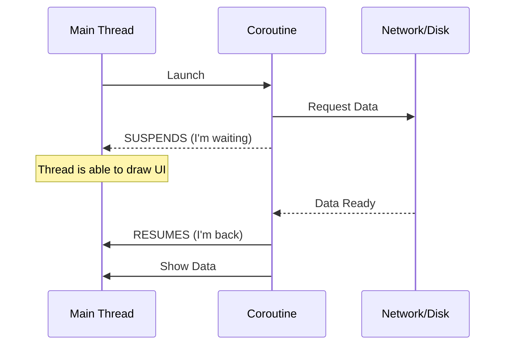

```mermaid
sequenceDiagram
    participant T as Main Thread
    participant C as Coroutine
    participant N as Network/Disk
    
    T->>C: Launch
    C->>N: Request Data
    C-->>T: SUSPENDS (I'm waiting)
    
    note over T: Thread is able to draw UI
    
    N-->>C: Data Ready
    C->>T: RESUMES (I'm back)
    C->>T: Show Data
```
